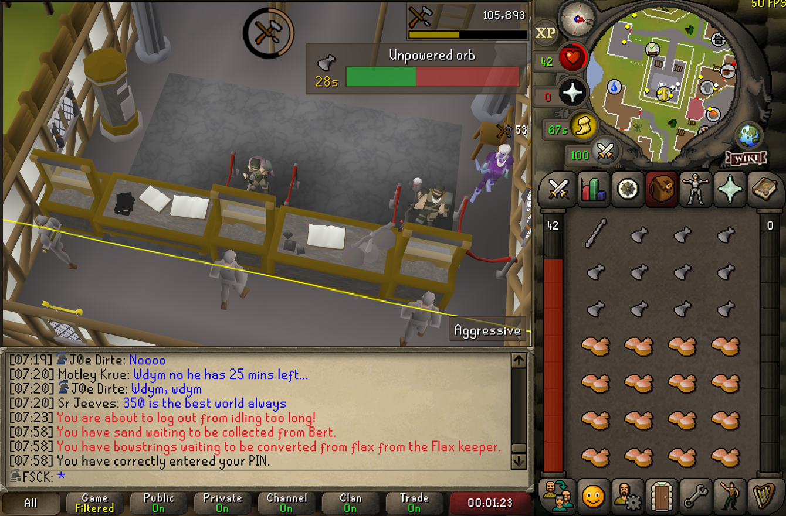

# Action Progress Plugin (BETA)

Displays an indicator showing how much progress you've made on your current action, and how long until it will finish.

# Changes

1.01

* Respects the user-defined infobox background colour.
* The "Ignore single action" property was mislabeled, it was inverted.

1.02

* Track Tempoross activities (Cooking and filling crates).
* Interrupt action when wearing or removing equipment.

1.03

* Rewritten a lot of core components.
* Many actions added.
* Many ingredient checks added, giving more accurate estimations of how many actions can be performed.
* Many customizations added, all actions can be enabled or disabled.
* Option to show skill icons instead of product icons (For example, Herblore icon instead of the potion being made).

1.03.1

* Fixed various issues with 1.03.
* IDQuery API moved to testing and replaced with constant ID arrays.
  This API had unforeseen issues due to database classes not existing in release environments.
* Fixed TemporossDetector.
* Fixed ItemClickDetector.